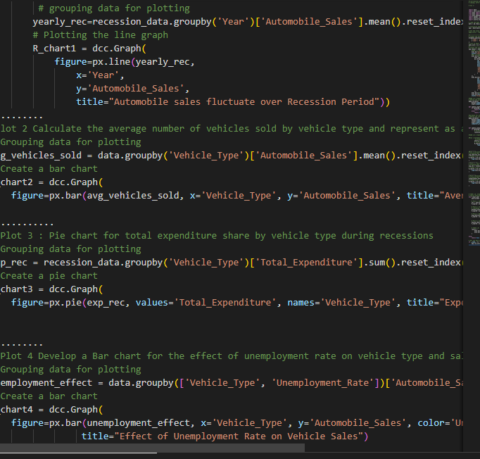
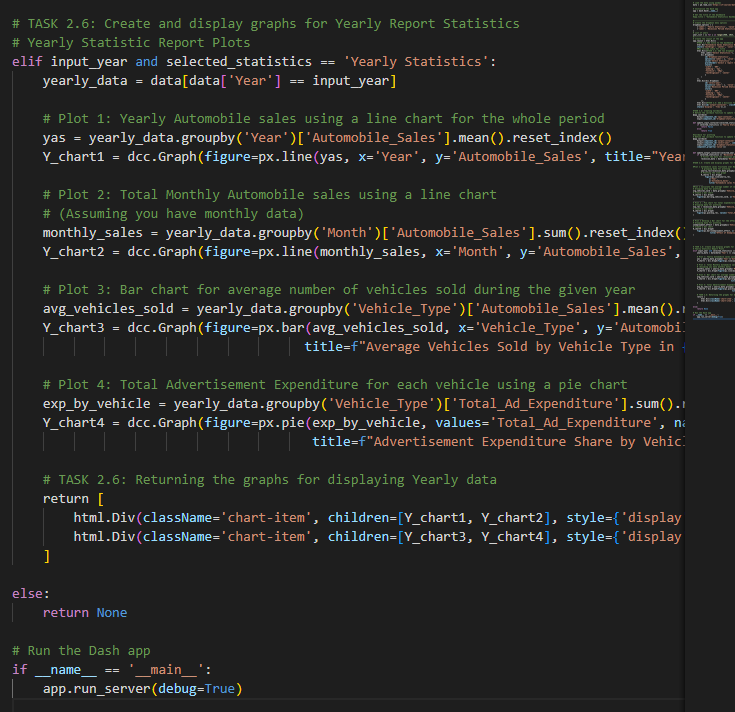

# IBM Data Science Professional Certificate — Coursework

Selected assignments and projects completed for the [IBM Data Science Professional Certificate](https://www.coursera.org/professional-certificates/ibm-data-science) (Coursera, 10 courses).

> 🚀 The certificate's capstone project lives in its own repo: **[SpaceX Falcon 9 Landing Prediction](https://github.com/oscarmndz89/Applied_Data_Science_Capstone)**

## Contents

### [01 — Data Science Tools](01-data-science-tools)
Jupyter ecosystem overview: languages, libraries and tools of the trade.

### [02 — Python Project: Stock Analysis](02-python-project-stock-analysis)
Extract and visualize stock data two ways, then build a comparison dashboard:
- [`01_extracting_stock_data_yfinance.ipynb`](02-python-project-stock-analysis/01_extracting_stock_data_yfinance.ipynb) — pull historical share prices with the `yfinance` API
- [`02_extracting_stock_data_webscraping.ipynb`](02-python-project-stock-analysis/02_extracting_stock_data_webscraping.ipynb) — scrape stock tables with BeautifulSoup
- [`03_tesla_gamestop_stock_dashboard.ipynb`](02-python-project-stock-analysis/03_tesla_gamestop_stock_dashboard.ipynb) — Tesla & GameStop share price vs. revenue dashboards

### [03 — Databases and SQL](03-sql-databases)
- [`chicago_data_analysis_sqlite.ipynb`](03-sql-databases/chicago_data_analysis_sqlite.ipynb) — real-world analysis joining Chicago census, public school and crime datasets
- [`advanced_sql_techniques.sql`](03-sql-databases/advanced_sql_techniques.sql) — views, stored procedures, transactions and joins (final project)
- Supporting scripts: [joins](03-sql-databases/multiple_tables_joins.sql), [subqueries](03-sql-databases/subqueries.sql)

### [04 — Data Analysis with Python](04-data-analysis-with-python)
- [`house_sales_king_county.ipynb`](04-data-analysis-with-python/house_sales_king_county.ipynb) — **final assignment**: predict house prices in King County, WA (wrangling → EDA → linear/polynomial/ridge regression pipelines)
- [`insurance_cost_analysis.ipynb`](04-data-analysis-with-python/insurance_cost_analysis.ipynb) — insurance charges: EDA, correlation and model refinement

### [05 — Data Visualization with Python](05-data-visualization)
**Final assignment** — historical automobile sales during recession periods:
- [`automobile_sales_visualizations.ipynb`](05-data-visualization/automobile_sales_visualizations.ipynb) — Matplotlib, Seaborn & Folium visualizations
- [`automobile_sales_dash_app.py`](05-data-visualization/automobile_sales_dash_app.py) — interactive Plotly Dash reporting dashboard

| Recession report | Yearly report |
|---|---|
|  |  |

### [06 — Machine Learning with Python](06-machine-learning-with-python)
Supervised and unsupervised algorithms applied to real datasets, numbered in course order:

| Notebook | Algorithm | Use case |
|---|---|---|
| [01](06-machine-learning-with-python/01_simple_linear_regression_co2.ipynb) / [02](06-machine-learning-with-python/02_multiple_linear_regression_co2.ipynb) | Simple & multiple linear regression | Vehicle CO₂ emissions |
| [03](06-machine-learning-with-python/03_knn_customer_classification.ipynb) | K-Nearest Neighbors | Telecom customer categories |
| [04](06-machine-learning-with-python/04_decision_trees_drug_prescription.ipynb) | Decision trees | Drug prescription |
| [05](06-machine-learning-with-python/05_logistic_regression_churn.ipynb) | Logistic regression | Customer churn |
| [06](06-machine-learning-with-python/06_svm_cancer_detection.ipynb) | Support Vector Machines | Cancer cell detection |
| [07](06-machine-learning-with-python/07_multiclass_classification.ipynb) | One-vs-All / One-vs-One | Multi-class strategies |
| [08](06-machine-learning-with-python/08_regression_trees.ipynb) | Regression trees | Real estate values |
| [09](06-machine-learning-with-python/09_kmeans_customer_segmentation.ipynb) | K-Means clustering | Customer segmentation |

---

*Oscar Mendez — [GitHub profile](https://github.com/oscarmndz89). Course materials © IBM/Coursera; the solutions and analysis in this repo are my own work.*
